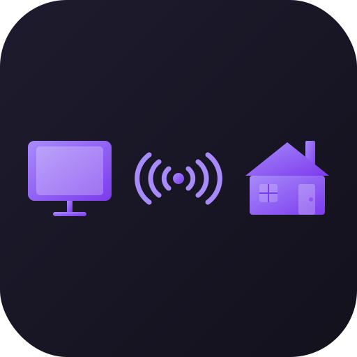

<p align="center">
  
</p>

<h1 align="center">PC Bridge</h1>

<p align="center">
  A lightweight cross-platform agent that bridges your PC with Home Assistant via MQTT.
</p>

<p align="center">
  <a href="https://github.com/dank0i/pc-bridge/releases/latest"></a>
  <a href="LICENSE"></a>
  
  <a href="https://github.com/dank0i/pc-bridge/releases"></a>
</p>

---

## What does it do?

PC Bridge runs on your PC and connects to Home Assistant over MQTT. It exposes your PC as a fully controllable device - detect games, send commands, get notifications, and automate everything.

### Features

| Feature | Description |
|---------|-------------|
| **Game Detection** | Monitors running processes and reports current game |
| **Game Catalog** | Exposes all configured games as a sensor for dynamic dashboards |
| **Idle Tracking** | Reports last user input time |
| **Power Events** | Detects sleep/wake/display state instantly via OS events |
| **System Sensors** | CPU, memory, battery, active window (native APIs) |
| **GPU Sensor** | GPU utilization percentage (PDH on Windows, sysfs/nvidia-smi on Linux) |
| **HWiNFO Sensors** | Hardware monitoring via HWiNFO64 shared memory: GPU/CPU power, temps, clocks, fan RPMs, VRM, framerate (Windows only) |
| **Network Sensor** | Network throughput (bytes/sec per direction) |
| **Disk Sensor** | Disk usage for configured paths |
| **Uptime Sensor** | System uptime in seconds |
| **Audio Control** | Volume, mute, media keys via Home Assistant |
| **Discord** | Join/leave voice channel commands |
| **Display Wake** | Wakes display after WoL, dismisses screensaver |
| **Remote Commands** | Lock, hibernate, restart, shutdown, sleep, screensaver |
| **Notifications** | Native Windows toast notifications from Home Assistant |
| **Steam Updates** | `steam_updating` (on/off) from `.acf` files, plus the names of games currently downloading/updating |
| **Auto-Update** | Signed updates (minisign + anti-rollback) with stable/beta/disabled channels |
| **Bridge Info** | Publishes version, OS, arch, and enabled features on connect |
| **Hot-Reload** | Feature toggles, game mappings, and per-sensor poll intervals apply live, no restart |
| **Settings Window** | Native `--ui` window (egui) for config; launching the app while it's running opens it |
| **System Tray** | Toggleable tray icon with Open Settings / Quit (Windows) |
| **Command Permissions** | `allow_global_launch` (default on) and `allow_global_close` (default off) gate reaching beyond configured games |
| **First-Run Wizard** | Settings window on first run (terminal wizard as headless fallback) |

### Supported Platforms

| Platform | Status |
|----------|--------|
| Windows 10/11 | Full support |
| Linux (X11) | Full support (bundled x11rb, no external tools needed) |
| Linux (Wayland) | Idle/active-window/display via bundled wlroots (`ext-idle-notify`) and GNOME/KDE D-Bus, no external tools |
| macOS | Build supported, limited features |

---

## Getting Started

### Download

Grab the latest release from [**GitHub Releases**](https://github.com/dank0i/pc-bridge/releases):

| Platform | Binary |
|----------|--------|
| Windows | `pc-bridge-windows.exe` |
| Linux | `pc-bridge-linux` |

### First Run

1. **Run the binary** - the native settings window opens (a terminal wizard is used
   only on a headless host) to guide you through:
   - MQTT broker connection
   - Device name
   - Feature selection (all opt-in)
2. Configuration is saved to `userConfig.json`
3. PC Bridge connects and auto-discovers with Home Assistant

After setup the agent runs headless. To reopen the settings window later, launch the
app again (it opens the window instead of starting a second agent), use the tray
icon's **Open Settings**, or run it with `--ui`.

---

## Configuration

Edit `userConfig.json` next to the executable:

```json
{
  "device_name": "my-pc",
  "mqtt": {
    "broker": "tcp://homeassistant.local:1883",
    "user": "mqtt_user",
    "pass": "mqtt_pass"
  },
  "features": {
    "running_game": true,
    "game_catalog": true,
    "launch_game": true,
    "steam_library": true,
    "idle_tracking": true,
    "sleep_wake": true,
    "display_state": true,
    "cmd_shutdown": true,
    "cmd_restart": true,
    "cmd_sleep": true,
    "cmd_lock": true,
    "notifications": true,
    "cpu_sensor": true,
    "memory_sensor": true,
    "active_window": true,
    "volume": true,
    "media_controls": true,
    "steam_updates": false,
    "discord": false,
    "gpu_sensor": false,
    "hwinfo_sensor": false,
    "network_sensor": false,
    "disk_sensor": false,
    "uptime_sensor": false
  },
  "update_channel": "stable",
  "disk_sensor_paths": ["C:\\"],
  "intervals": {
    "game_sensor": 5,
    "last_active": 10
  },
  "games": {
    "bf6": "battlefield_6",
    "FortniteClient-Win64-Shipping": "fortnite",
    "MarvelRivals_Shipping": "marvel_rivals"
  },
  "custom_sensors_enabled": false,
  "custom_commands_enabled": false,
  "custom_command_privileges_allowed": false,
  "allow_raw_commands": false,
  "custom_sensors": [],
  "custom_commands": []
}
```

### Feature Flags

Every feature is an opt-in boolean in the `features` object of `userConfig.json`.

The easiest way to manage them is the **pc-bridge settings app** (the tray/window
UI): it lists every feature with its exact config key, the Home Assistant entity
it reports as, its prerequisites, and a short "how it works" note, and writes the
config for you. That in-app catalog is the source of truth for the full flag list.

Defaults: the power and display controls (sleep/wake, shutdown, restart, sleep,
lock, logoff, monitor on/off) are on; everything else (game detection, hardware
and system sensors, audio, Discord, notifications, HWiNFO, etc.) is off until you
enable it.

Flags are granular, e.g. game detection is `running_game` / `game_catalog` /
`steam_library` / `launch_game` / `close_game`, and audio is `volume` /
`media_controls`. The older coarse keys (`game_detection`, `power_events`,
`system_sensors`, `audio_control`) are still accepted and are migrated to the
granular flags automatically on first load.

### Other Settings

| Setting | Default | Description |
|---------|---------|-------------|
| `update_channel` | `"stable"` | Update channel: `"stable"`, `"beta"`, or `"disabled"` |
| `disk_sensor_paths` | `[]` | Paths to check for disk usage (e.g. `["C:\\", "D:\\"]` or `["/", "/home"]`) |
| `show_tray_icon` | `true` | Show the Windows system tray icon (Open Settings / Quit); toggles live |
| `allow_global_launch` | `true` | Let launch commands start titles that aren't in your configured games |
| `allow_global_close` | `false` | Let close/kill commands target processes that aren't configured games |
| `allow_raw_commands` | `false` | Run arbitrary `exe:`/`lnk:`/`url:` payloads not matching a configured game |
| `intervals` | per-sensor | Poll intervals (seconds) per sensor: `cpu`, `memory`, `gpu`, `network`, `disk`, ... |

> **Note:** Missing fields are automatically added with their defaults when upgrading.

### HWiNFO Sensors (Windows only)

When `hwinfo_sensor: true`, pc-bridge reads ~20 hardware sensors from HWiNFO64's shared memory and exposes them as Home Assistant entities. Entities published:

| Category | Sensors |
|---|---|
| GPU | `gpu_power`, `gpu_temp`, `gpu_hotspot_temp`, `gpu_memory_temp`, `gpu_core_clock`, `gpu_memory_clock`, `gpu_core_load`, `gpu_vram_usage_pct`, `gpu_fan_rpm` |
| CPU | `cpu_package_power`, `cpu_soc_power`, `cpu_package_temp`, `cpu_effective_clock`, `cpu_total_usage` |
| Mainboard | `vrm_temp`, `case_fan_cpu`, `case_fan_cpu_opt`, `case_fan_system_1`, `case_fan_system_2` |
| Game | `framerate` |

Plus `hwinfo_diagnostic` showing which sensor names matched and which didn't on your hardware.

#### Setup

1. Install [HWiNFO64](https://www.hwinfo.com/) (free).
2. Open HWiNFO Settings → check **Shared Memory Support**. Restart HWiNFO.
3. Set `"hwinfo_sensor": true` in `userConfig.json` and restart pc-bridge.

HWiNFO must be running for the sensors to publish. Entities become `unavailable` in HA when HWiNFO closes; they restore automatically when it reopens.

Sensors are matched by name patterns and tolerate vendor differences (Intel/AMD CPUs, NVIDIA/AMD GPUs, various motherboard sensor naming). Anything that doesn't match on your specific hardware shows up in the `hwinfo_diagnostic` attributes so you can see what's missing.

Publishes are throttled per-sensor: power changes by 5W, temperatures by 1°C, clocks by 50MHz, with a 30-second heartbeat so HA always has a recent value. The producer task only reads 8 bytes of shared memory between updates, so the CPU cost is negligible.

### Steam Updates

With the Steam feature on, `sensor.<device>_steam_updating` reports on/off from
Steam's `.acf` files (no setup, no ports), and its attributes list the names of the
games currently downloading or updating. A live download *percentage* is not exposed:
Steam only makes that available in-process (via its CEF debug port or DLL injection),
both of which are security/stability tradeoffs pc-bridge deliberately avoids.

### Games Configuration

The `games` object maps process names to game IDs:
- **Key**: Part of the process name to match (case-insensitive)
- **Value**: The game ID reported to Home Assistant (string or object)

**Full format** (used by Steam auto-discovery):

```json
{
  "games": {
    "bg3": {
      "game_id": "baldurs_gate_3",
      "app_id": 1086940,
      "name": "Baldur's Gate 3",
      "entity_id": "baldur_s_gate_3",
      "exposed": true
    }
  }
}
```

| Field | Required | Description |
|-------|----------|-------------|
| `game_id` | Yes | Identifier reported to Home Assistant |
| `app_id` | No | Steam App ID (set automatically by Steam discovery) |
| `name` | No | Display name (defaults to title-cased `game_id`) |
| `entity_id` | No | HA switch entity slug override - lowercase alphanumeric + underscores only, no `switch.` prefix (defaults to `game_id`) |
| `exposed` | No | Whether to include in the game catalog sensor (default: `true`) |
| `auto_discovered` | No | Set automatically by Steam discovery |

---

## Custom Sensors & Commands

Custom sensors and commands are configured at the root level of `userConfig.json` (not inside `features`).

### Security Model

Custom features are **disabled by default** and require explicit opt-in:

| Setting | Default | Purpose |
|---------|---------|---------|
| `custom_sensors_enabled` | `false` | Enable custom sensor polling |
| `custom_commands_enabled` | `false` | Enable custom command execution |
| `custom_command_privileges_allowed` | `false` | Allow commands marked `admin: true` |
| `allow_raw_commands` | `false` | Allow arbitrary MQTT payloads to be executed as shell commands |

> **⚠️ `allow_raw_commands`**: When `false` (default), only predefined commands (Shutdown, Sleep, Wake, etc.) and configured custom commands can be executed. Unknown command topics with a non-empty payload are silently dropped. Set to `true` only if you need to send ad-hoc shell commands via MQTT - this is a security risk if your MQTT broker is not properly secured.

### Custom Sensors

Monitor anything - GPU temperature, service status, disk space:

```json
{
  "custom_sensors_enabled": true,
  "custom_sensors": [
    {
      "name": "gpu_temp",
      "type": "powershell",
      "script": "(Get-CimInstance -Namespace root/cimv2 -ClassName Win32_PerfFormattedData_GPUPerformanceCounters_GPUEngine | Where-Object Name -like '*engtype_3D*' | Select-Object -First 1).UtilizationPercentage",
      "unit": "°C",
      "icon": "mdi:thermometer",
      "interval_seconds": 30
    },
    {
      "name": "disk_free_c",
      "type": "powershell",
      "script": "[math]::Round((Get-PSDrive C).Free / 1GB, 1)",
      "unit": "GB",
      "icon": "mdi:harddisk",
      "interval_seconds": 300
    },
    {
      "name": "is_vpn_connected",
      "type": "process_exists",
      "process_name": "openvpn"
    },
    {
      "name": "hostname",
      "type": "registry",
      "registry_path": "HKLM\\SYSTEM\\CurrentControlSet\\Control\\ComputerName\\ComputerName",
      "registry_value": "ComputerName"
    }
  ]
}
```

**Sensor Types:**

| Type | Description | Required Fields |
|------|-------------|-----------------|
| `powershell` | Run PowerShell, use stdout as value | `script` |
| `process_exists` | Returns "true"/"false" | `process_name` |
| `file_contents` | Read file contents | `file_path` |
| `registry` | Read registry value (Windows) | `registry_path`, `registry_value` |

### Custom Commands

Execute custom actions from Home Assistant:

```json
{
  "custom_commands_enabled": true,
  "custom_command_privileges_allowed": true,
  "allow_raw_commands": false,
  "custom_commands": [
    {
      "name": "flush_dns",
      "type": "powershell",
      "script": "ipconfig /flushdns",
      "icon": "mdi:dns",
      "admin": true
    },
    {
      "name": "clear_temp",
      "type": "powershell",
      "script": "Remove-Item $env:TEMP\\* -Recurse -Force -ErrorAction SilentlyContinue",
      "icon": "mdi:broom"
    },
    {
      "name": "open_calculator",
      "type": "executable",
      "executable": "calc.exe"
    }
  ]
}
```

**Command Types:**

| Type | Description | Required Fields |
|------|-------------|-----------------|
| `powershell` | Run PowerShell script | `script` |
| `executable` | Run an executable | `executable`, optional `args` |
| `shell` | Run via cmd.exe | `shell_command` |

`powershell` and `shell` are separate types because they use different interpreters. Use `powershell` for PowerShell cmdlets and scripts. Use `shell` for cmd.exe commands (batch scripts, `.bat` files, `dir`, `copy`, etc.) that may not work in PowerShell. Admin `powershell` commands use base64-encoded `-EncodedCommand` to prevent injection. Admin `shell` commands are elevated via `Start-Process cmd -Verb RunAs`.

> **Running script files:** To run `.ps1` files, use the `powershell` type with `"script": "& 'C:\\path\\script.ps1'"`. The `executable` type works for `.bat`/`.cmd` files directly, but `.ps1` files require PowerShell's execution policy handling.

**Security:**
- Commands with `admin: true` require `custom_command_privileges_allowed: true`
- Admin commands run via `Start-Process -Verb RunAs` (UAC prompt may appear)
- Non-admin commands run in current user context

---

## Notifications

PC Bridge can display Windows toast notifications sent from Home Assistant. Uses native WinRT APIs for ~10ms latency (no PowerShell overhead).

### Using the Notify Service

After PC Bridge connects, a `notify.send_message` entity is auto-discovered:

```yaml
# In HA automations, scripts, etc.
action: notify.send_message
metadata: {}
data:
  message: Motion detected at front door!
  title: Security Alert
target:
  entity_id: notify.my_pc_notification
```

### Payload Format

Send JSON to the notify topic for full control:

```json
{"title": "Alert Title", "message": "Notification body text"}
```

Or just plain text (uses "Home Assistant" as default title):

```
Your plain text message here
```

### Direct MQTT Topic

You can also publish directly to the MQTT topic:

```
Topic: pc-bridge/notifications/{device_name}
Payload: {"title": "My Title", "message": "My message"}
```

### Example Automations

**Doorbell notification:**
```yaml
automation:
  - alias: "Doorbell: Notify PC"
    trigger:
      - platform: state
        entity_id: binary_sensor.doorbell
        to: "on"
    action:
      - action: notify.send_message
        data:
          title: "Doorbell"
          message: "Someone is at the door"
        target:
          entity_id: notify.my_pc_notification
```

**Washer done notification:**
```yaml
automation:
  - alias: "Laundry: Notify when done"
    trigger:
      - platform: state
        entity_id: sensor.washer_status
        to: "complete"
    action:
      - action: notify.send_message
        data:
          title: "Laundry"
          message: "Washer cycle complete!"
        target:
          entity_id: notify.my_pc_notification
```

**Game suggestion notification:**
```yaml
script:
  suggest_game:
    sequence:
      - action: notify.send_message
        data:
          title: "Game Time?"
          message: "How about playing {{ states('sensor.suggested_game') }}?"
        target:
          entity_id: notify.my_pc_notification
```

---

## MQTT Commands

Send commands via MQTT button topics:

| Button | Description |
|--------|-------------|
| `Screensaver` | Activate screensaver |
| `Wake` | Wake display, dismiss screensaver |
| `Lock` | Lock workstation |
| `Shutdown` | Power off the PC |
| `Sleep` | Put PC to sleep |
| `Hibernate` | Hibernate the PC |
| `Restart` | Restart the PC |

### Audio Commands (requires `audio_control: true`)

| Button | Description |
|--------|-------------|
| `MediaPlayPause` | Play/pause media |
| `MediaNext` | Next track |
| `MediaPrevious` | Previous track |
| `MediaStop` | Stop media |
| `VolumeMute` | Toggle mute |
| `VolumeSet` | Set volume (payload: 0-100) |

### Launch Payloads

The `Launch` button accepts special payloads:

| Payload | Description |
|---------|-------------|
| `steam:1234` | Launch Steam game by App ID |
| `update:1234` | Validate/update an installed Steam game without launching it (alias: `validate:1234`; both map to `steam://validate/<id>`) |
| `epic:GameName` | Launch Epic game |
| `exe:C:\path\to.exe` | Run executable directly |
| `lnk:C:\path\to.lnk` | Run shortcut file |
| `close:processname` | Close process gracefully |

Paths with spaces work automatically -- no manual quoting needed (e.g., `exe:C:\Program Files\Game\game.exe`). Shell metacharacters (`` ; | & $ ` ' ``and on Windows also `"`) are rejected to prevent command injection.

> **Note:** The `Launch` button requires you to define actions in Home Assistant that send the appropriate payload. Unlike custom commands (which are self-contained), Launch is a generic endpoint that executes whatever payload you send it.

### Discord Commands (requires `discord: true`)

Control Discord voice channels directly from Home Assistant.

| Button | Description |
|--------|-------------|
| `DiscordJoin` | Join a voice channel (requires payload) |
| `DiscordLeaveChannel` | Leave current voice channel (no payload) |

**DiscordJoin** uses the `Launch` system under the hood - send a `url:` payload with a Discord deep link:

```
url:discord://discord.com/channels/SERVER_ID/CHANNEL_ID
```

**DiscordLeaveChannel** simulates a keyboard shortcut (default: `Ctrl+F6`, Discord's built-in "Disconnect from Voice Channel" hotkey). Customize it in `userConfig.json`:

```json
{
  "discord_keybind": "ctrl+f6"
}
```

**Example HA scripts:**

```yaml
# Join a specific voice channel
discord_join_gaming:
  alias: "Discord: Join Gaming Channel"
  sequence:
    - action: mqtt.publish
      data:
        topic: homeassistant/button/my-pc/DiscordJoin/action
        payload: "url:discord://discord.com/channels/123456789/987654321"

# Leave any voice channel
discord_leave:
  alias: "Discord: Leave Channel"
  sequence:
    - action: mqtt.publish
      data:
        topic: homeassistant/button/my-pc/DiscordLeaveChannel/action
        payload: "PRESS"
```

> **Tip:** You can find the server and channel IDs in Discord by enabling Developer Mode (Settings → App Settings → Advanced → Developer Mode), then right-clicking a server or channel and selecting "Copy ID".

---

## Home Assistant Integration

PC Bridge auto-discovers via MQTT. After connecting, you'll get:

**Sensors:**
- `sensor.<device>_runninggames` - Current game (or "none") - instant via process events
- `sensor.<device>_sleep_state` - "awake" or "sleeping" - instant via OS power events
- `sensor.<device>_lastactive` - ISO timestamp of last input (polled 10s)
- `sensor.<device>_screensaver` - "on" or "off" - instant via WMI events
- `sensor.<device>_display` - "on" or "off" - instant via OS power events
- `sensor.<device>_cpu_usage` - CPU usage percentage (polled 10s)
- `sensor.<device>_memory_usage` - Memory usage percentage (polled 10s)
- `sensor.<device>_battery_level` - Battery percentage - instant via OS power events
- `sensor.<device>_battery_charging` - "true" or "false" - instant via OS power events
- `sensor.<device>_active_window` - Current foreground window title - instant via SetWinEventHook
- `sensor.<device>_game_catalog` - Number of exposed games, with full game list as attributes (retained)
- `sensor.<device>_steam_updating` - "on"/"off" with game list - instant via filesystem watcher
- `sensor.<device>_volume_level` - System volume percentage
- `sensor.<device>_gpu_usage` - GPU utilization percentage (polled)
- `sensor.<device>_network_throughput` - Network throughput with rx/tx attributes (polled)
- `sensor.<device>_disk_usage` - Highest disk usage % with per-path attributes (polled)
- `sensor.<device>_system_uptime` - System uptime in seconds (polled 60s)
- `sensor.<device>_bridge_info` - Agent version, OS, arch, enabled features (on connect)
- `sensor.<device>_<custom>` - Any custom sensors you define

**Buttons:**
- `button.<device>_screensaver`
- `button.<device>_wake`
- `button.<device>_lock`
- `button.<device>_shutdown`
- `button.<device>_sleep`
- `button.<device>_hibernate`
- `button.<device>_restart`
- `button.<device>_launch`
- `button.<device>_refreshsteamgames` (requires `game_detection`)
- `button.<device>_mediaplaypause`
- `button.<device>_medianext`
- `button.<device>_mediaprevious`
- `button.<device>_mediastop`
- `button.<device>_volumemute`
- `button.<device>_volumeset`
- `button.<device>_discordjoin` (requires `discord`)
- `button.<device>_discordleavechannel` (requires `discord`)
- `button.<device>_<custom>` - Any custom commands you define

**Notifications:**
- `notify.<device>_notification` - Send toast notifications to your PC

Where `<device>` is your configured `device_name` with dashes replaced by underscores.

---

## Linux Requirements

Idle time, active window, display power, and display wake are handled by bundled
pure-Rust backends (x11rb on X11; `ext-idle-notify` / wlr and GNOME/KDE D-Bus on
Wayland), so **no external tools are required** for those anymore. A few things
still shell out to system utilities that are usually already installed:

| Package | Purpose |
|---------|---------|
| `pactl` | Audio control (ships with PulseAudio/PipeWire) |
| `gdbus` | Sleep/wake detection (ships with GLib) |
| `playerctl` | Now-playing / media info (optional) |
| `xdotool` / `xprintidle` | Optional fallbacks only if the bundled X11 backend can't attach |

Building the `--ui` settings window on Linux needs GTK dev headers for the file
dialog (`libgtk-3-dev` / `gtk3-devel` / `gtk3`); the headless agent does not.

---

## Run as Service

### Windows

```powershell
# Create service
sc create PCBridge binPath= "C:\path\to\pc-bridge.exe"
sc config PCBridge start= auto
sc start PCBridge
```

### Linux (systemd)

Create `/etc/systemd/system/pc-bridge.service`:

```ini
[Unit]
Description=PC Bridge - Home Assistant Integration
After=network.target

[Service]
Type=simple
ExecStart=/usr/local/bin/pc-bridge
WorkingDirectory=/usr/local/bin
Restart=always
RestartSec=10
User=your-username

[Install]
WantedBy=multi-user.target
```

Then:

```bash
sudo systemctl daemon-reload
sudo systemctl enable pc-bridge
sudo systemctl start pc-bridge
```

---

## Performance

All system sensors use native APIs for minimal overhead:

| Metric | Value |
|--------|-------|
| Binary size | ~1.3 MB |
| Memory usage | ~2.5 MB |
| CPU usage | < 1% |

**Native API Performance (Windows):**
- `GetSystemTimes` (CPU): ~1μs
- `GlobalMemoryStatusEx` (memory): ~1μs
- `GetSystemPowerStatus` (battery): ~1μs
- `GetForegroundWindow` (active window): ~1μs
- `IAudioEndpointVolume` (volume): ~50μs

**Custom Sensors Impact:**
- Each PowerShell sensor: ~10-50ms execution per poll
- Process check sensor: ~1ms (native API)
- Registry read: ~0.1ms (native API)
- Memory: +~100 bytes per sensor for state tracking
- Recommended: Keep intervals ≥30s for PowerShell sensors

---

## Building from Source

```bash
# Install Rust (https://rustup.rs)
curl --proto '=https' --tlsv1.2 -sSf https://sh.rustup.rs | sh

# Clone and build
git clone https://github.com/dank0i/pc-bridge.git
cd pc-bridge

# Windows (native)
cargo build --release

# Linux (native)
cargo build --release

# Cross-compile Windows from Linux/macOS
rustup target add x86_64-pc-windows-gnu
cargo build --release --target x86_64-pc-windows-gnu
```

---

## License

This project is licensed under the [MIT License](LICENSE).
